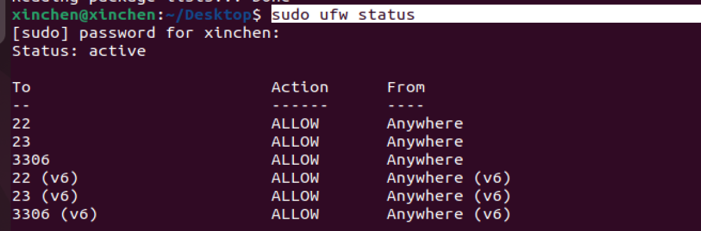

# Ubuntu简单开启防火墙

首先Ubuntu系统中带有ufw·命令

打开/关闭防火墙：

```shell
$sudo ufw enable 	#打开防火墙
Firewall is active and enabled on system startup
$sudo ufw status	#查看状态
Status: active   	#防火墙已打开
$sudo ufw disable	#关闭防火墙
Firewall stopped and disabled on system startup
$sudo ufw status    #查看状态
Status: inactive
```

**注意：打开防火墙之后可能会影响访问，可以开放一些端口**

```shell
ufw allow [端口号]
```

sudo ufw status

使用该命令查看规则



```shell
sudo ufw delete allow/deny  [端口]
#删除已有（允许/拒绝）的规则

```

